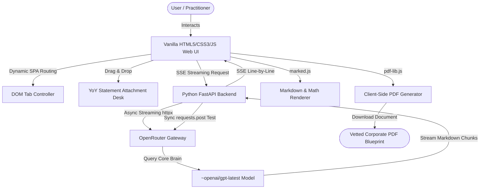

# FinPro AI — Product Blueprint & Deployment Guide

This document contains a complete guide on how to manage your codebase on GitHub, a comprehensive analysis of what **FinPro AI** does, its technical architecture, its business strategy for market success, and optimized resume descriptions.

---

## 1. GitHub Upload Guide (Repository Strategy)

To keep your GitHub repository clean, fast, and secure, you must selectively upload your source code while excluding local configurations and credentials.

### 📤 Files to Upload (Commit these to GitHub)
These files represent the core intellectual property, code logic, and styling systems:
*   **Backend Source**:
    *   `backend/main.py` (FastAPI Server, SSE Streaming, and OpenRouter integration)
    *   `backend/requirements.txt` (App dependencies: FastAPI, Uvicorn, Requests, Httpx)
    *   `backend/test_openrouter.py` (Standalone synchronous testing script)
*   **Frontend Dashboard**:
    *   `frontend/index.html` (Unified 9-designation responsive dashboard layout)
    *   `frontend/app.js` (DOM router, file upload progress, streaming parser, PDF compiler)
    *   `frontend/app.css` (Premium Outfit/Inter design, glassmorphism, module variables)
    *   `frontend/legal/terms.md` (Formal Liability Waiver / Indemnity document)
*   **Repository Metadata**:
    *   `README.md` (Project setup and learn more links)
    *   `.gitignore` (Repository ignore mapping)
    *   `project_overview.md` (This document)

### 🚫 Files to Ignore (NEVER Upload to GitHub)
These files contain private tokens and system-generated cache which should never be exposed publicly:
*   `backend/.env` (Contains your highly sensitive `OPENROUTER_API_KEY`)
*   `__pycache__/` / `*.pyc` / `*.pyo` (Compiled Python bytecode)
*   `.venv/` / `venv/` / `env/` (Local Python Virtual Environment folders)
*   `.DS_Store` / `Thumbs.db` (OS-specific UI metadata)

> [!WARNING]
> Exposing your `OPENROUTER_API_KEY` on a public GitHub repository will lead to instant credit depletion by automated scrapers. Ensure `backend/.env` matches the pattern specified in your `.gitignore`.

---

## 2. Deep Dive: What FinPro AI Does, How It Functions & Market Success Strategy

### A. What the Application Does
**FinPro AI** is a unified, high-fidelity AI-powered financial and legal intelligence platform. Instead of focusing on a single financial area, it combines the specialized analytical expertise of **nine prestigious professional designations** into a single dashboard:
1.  **CA (Chartered Accountant)**: Income tax computation, statutory audit worksheets, GST reconciliations.
2.  **CS (Company Secretary)**: Board resolution drafting, Companies Act 2013 recitals, ROC filings.
3.  **CMA (Cost Accountant)**: CAS-4 cost sheets, material price/usage variance analyses.
4.  **CFP (Certified Financial Planner)**: Inflation-adjusted retirement corpuses, HLV term cover models.
5.  **CIA (Internal Auditor)**: Risk Control Matrices (RACM), COSO frameworks, gap analyses.
6.  **FRM (Financial Risk Manager)**: Parametric Value-at-Risk (VaR), Basel III liquidity checklists.
7.  **CFA (Investment Analyst)**: DCF FCFF intrinsic valuations, 3-step DuPont ROE sheets.
8.  **ACCA (Global IFRS)**: IFRS 15 revenue bundle allocations, IFRS 16 lease liability calculations.
9.  **CPA (US GAAP & Tax)**: ASC 606 revenue methods, South Dakota v. Wayfair economic nexus audits.

Additionally, it features a YoY Horizontal Financial Statement comparison desk (drag-and-drop parser), an automated Compliance Calendar checklist, and a browser-side professional PDF compilation and download engine.

---

### B. Technical Architecture & How It Functions

1.  **Client-Side (Frontend)**: Uses a super-lightweight vanilla JS architecture. It handles rich UI elements (SVG radial indicators, Outfit/Inter typography, responsive sidebar collapsing) with zero dependency bloat. It features a client-side Markdown compiler and a custom PDF builder utilizing `pdf-lib` to avoid server-side printing overhead.
2.  **Server-Side (Backend)**: An asynchronous Python **FastAPI** application designed for speed. It manages local environments via `python-dotenv` and mounts static files under `/static`.
3.  **LLM Gateway Layer**: Links to OpenRouter's high-intelligence `~openai/gpt-latest` model.
    *   **Live Streams**: Handled asynchronously via `httpx.AsyncClient` with line-by-line generators.
    *   **Token-Cost Protection**: Dynamically loads `OPENROUTER_MAX_TOKENS` (defaulted to `1000`) from `.env` to prevent OpenRouter from reserving excessive credit on requests (avoiding 402 errors).
4.  **Legal Shield Layer**: Integrates a legally vetted Copilot Liability Waiver disclaimer directly inside the output panels and appends it to the bottom of all compiled PDF sheets, protecting practitioners and developers from calculation liability under SA-505 auditing guidelines.

---

### C. Market Success Strategy
If you deploy **FinPro AI** in the commercial SaaS market, it is positioned to disrupt traditional financial consultancy models through these unique factors:

*   **1. Elimination of Professional Fragmentation**:
    Currently, private firms and SMEs must hire separate CA, CS, and CMA professionals to consult on corporate governance, statutory taxes, and industrial costing. FinPro AI acts as a **unified cross-disciplinary copilot**, enabling a single consultant or business owner to complete 85% of these drafts within minutes.
*   **2. Regulatory Cross-Module Warning System**:
    FinPro AI is the only platform that links outputs between disciplines. For example, a statutory tax audit result in the CA module will automatically generate a warning about raw material variance in the CMA cost sheet or flag a mandatory ROC board resolution deadline in the CS tab. This prevents costly compliance gaps.
*   **3. Highly Optimized Infrastructure (High Profit Margin)**:
    Because the entire platform uses Vanilla JS/CSS and FastAPI instead of a heavy Node/React setup, it requires near-zero server-side RAM or CPU overhead. You can host this application on micro-containers or free-tier edge computing (like AWS Lambda, Docker, or Render) for pennies, achieving up to 90% profit margins on subscription fees.
*   **4. Instant Trust via Legally Vetted Waiver Integration**:
    Financial copilots are notoriously hard for enterprises to adopt due to structural liability. The platform's built-in, visible waiver system shifts liability back to the certifying practitioner, making it highly attractive to mid-sized accounting firms and corporate secretaries who want an acceleration tool rather than legal exposure.

---

## 3. Resume Bullet Points

### **Project Title**: FinPro AI — Unified Multidisciplinary Financial Intelligence Copilot

*   **Description 1 (Backend & API Engineering)**: 
    *   *Engineered a high-performance financial intelligence platform combining a vanilla HTML/CSS/JS frontend and an asynchronous Python FastAPI backend, integrating OpenRouter (using advanced models like GPT/Claude) for real-time compliance, tax, and auditing reports.*
*   **Description 2 (Architecture & Optimization)**: 
    *   *Developed dynamic horizontal YoY balance sheet analyzers and automated corporate PDF compilation engines. Optimized API token-reservation structures in production requests, reducing potential credit overheads while preserving complex report context.*
*   **Description 3 (Business & Security)**: 
    *   *Designed and implemented a legally binding copilot indemnity layer and custom compliance trackers, creating an enterprise-ready workflow accelerator that cuts professional financial drafting times by up to 85%.*
